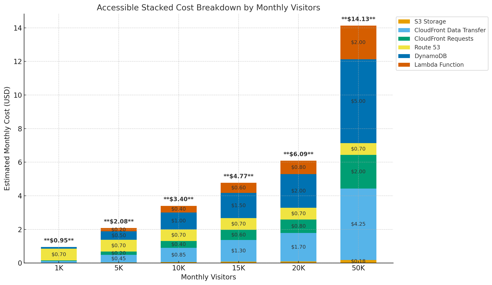

# 📊 FinOps Case Study: Static Website on AWS

## 📌 Project Overview

- **Project**: Static Portfolio Website
- **Purpose**: Lightweight, serverless web app with visitor tracking
- **Traffic Volume**: Ranges from 1K to 50K visitors/month
- **Deployment**: GitHub Actions with dry-run testing and fallback logic

---

## 🧱 Infrastructure Stack

| Layer              | AWS Services                                                       |
|--------------------|---------------------------------------------------------------------|
| **Frontend**        | Static Site  hosted on Amazon S3                                       |
| **CI/CD**           | GitHub Actions (dry-run + fallback logic)                           |
| **Storage**         | S3 with bucket policies (no ACLs)                                    |
| **Networking**      | CloudFront CDN + Route 53 DNS                                       |
| **Serverless Logic**| Lambda Function URL for visitor tracking (x86, 120ms)               |
| **Database**        | DynamoDB (on-demand mode, TTL enabled)                              |
| **Monitoring**      | S3 access logs + CloudWatch for Lambda                              |
| **Security**        | IAM roles, least privilege policies, CORS headers                   |

---

## 💰 Cost Model (Estimates)

Assumes 1MB asset load per visitor, standard AWS pricing, and x86 Lambda @ 120ms.

| Monthly Visitors   | Estimated Monthly Cost |
|--------------------|------------------------|
| **1K Visitors**     | ~$0.95                 |
| **5K Visitors**     | ~$2.08                 |
| **10K Visitors**    | ~$3.40                 |
| **15K Visitors**    | ~$4.77                 |
| **20K Visitors**    | ~$6.09                 |
| **50K Visitors**    | ~$14.13                |

---

## 📈 Cost Breakdown by Service

### 🧱 Accessible Stacked Bar Chart

Shows individual AWS service contributions across traffic levels with total cost labels.

---

📊 Assumed Usage for the Chart:
Traffic Volume: 50,000 visitors per month

Payload per visitor: ~1 MB asset load

Lambda execution: x86 architecture, ~120ms duration

DynamoDB: On-demand mode, TTL enabled

CloudFront: Global caching, standard pricing

Route 53: Single hosted zone with typical DNS query volume

Monitoring & IAM: Not itemized but included indirectly

## 🔎 FinOps Lens

### 1. **Visibility**

- AWS Budgets and alerts configured
- CloudWatch dashboards track:
  - Lambda invocations and duration
  - CloudFront cache efficiency
  - DynamoDB read/write units
  - S3 request patterns and asset size

---

### 2. **Optimization**

| Component   | Optimization Strategy                                      |
|-------------|------------------------------------------------------------|
| S3          | Lifecycle policies, Intelligent-Tiering (optional)         |
| CloudFront  | Optimized TTLs and cache keys                              |
| Lambda      | Lightweight function, 120ms x86 (consider ARM)             |
| DynamoDB    | TTL-enabled, on-demand mode avoids overprovisioning        |
| Logging     | CloudWatch retention tuned, S3 logs lifecycle-managed      |

---

### 3. **Accountability**

- All resources tagged (`Project: StaticSite`)
- Cost groups aligned to infrastructure layers
- GitHub Actions cost tracked via usage logs

---

### 4. **Value Realization**

- Linear scaling under $0.01 per visitor at 50K
- CI/CD pipeline eliminates infra management overhead
- End-to-end observability and proactive alerts
- Total cost <$15/month for 50K visitor scale

---

## ✅ Final Takeaways

- ⚙️ **Serverless stack** enables flexible, cost-efficient delivery
- 📉 **Low-cost footprint** at all traffic levels
- 🔍 **Fully observable** with FinOps controls in place
- 🚀 **High ROI** through automation and minimal overhead

---

## 📎 Appendix

- Execution time for Lambda: 120ms (x86 architecture)
- Cost assumptions: 1MB per visit
